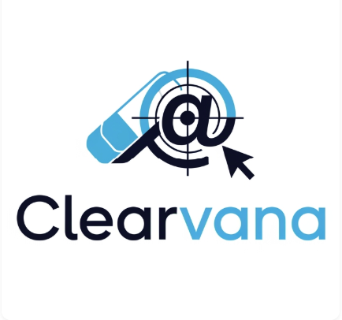

# Clearvana POC - Data Model

Welcome to the Clearvana Proof of Concept (POC) Data Model documentation. This site contains comprehensive information about the analytic data model designed for Clearvana, a company focused on combating disinformation on the Web.

## Overview

This POC demonstrates the data model architecture, schema design, and testing framework for analyzing and tracking disinformation patterns across web platforms.

## Quick Links

- [Schema Design](schema-design.md) - Explore the database schema and entity relationships
- [Documentation](documentation.md) - Detailed documentation of the data model components
- [Test Lineage](test-lineage.md) - Test coverage and data lineage tracking
- [Data Roadmap](clearvana_data_roadmap.md) - Strategic roadmap for data infrastructure and analytics

## Project Goals

1. **Data Model Design** - Create a scalable and efficient data model for disinformation tracking
2. **Schema Documentation** - Provide clear documentation of all entities and relationships
3. **Test Coverage** - Ensure comprehensive testing and data lineage tracking
4. **Proof of Concept** - Validate the approach with real-world scenarios

## About Clearvana

Clearvana is dedicated to identifying and addressing disinformation on the Web, providing tools and analytics to combat false information and improve information quality online.

---

*Last Updated: {{ site.time | date: '%B %d, %Y' }}*
