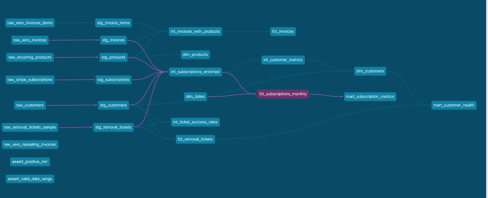
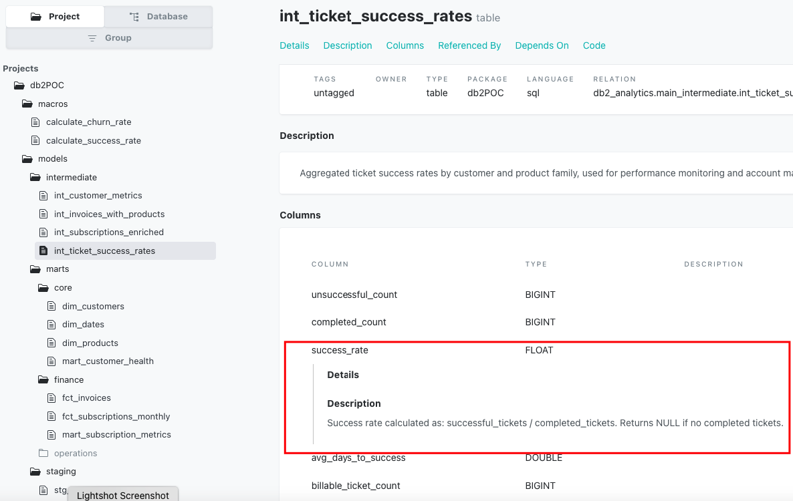

  

------------------------------------------------------------------------

# Clearvana POC - Data Model

Welcome to the Clearvana Proof of Concept (POC) Data Model documentation. This site contains comprehensive information about the analytic data model designed for Clearvana, a company focused on combating disinformation on the Web.

## Overview

Overview — Moving to a Modern Analytics Platform with DBT

Clearvana’s current approach — running analytics directly from a cloned MySQL transactional database — creates structural limitations that will continue to erode data trust, prevent a true single source of truth, and introduce long-term scalability and maintenance risks.

**Migrating to a dedicated analytical database powered by DBT is not just a technical upgrade
— it is an organizational shift toward reliable, decision-grade data.**

------------------------------------------------------------------------
## Why Change?

**1. Rebuild Data Trust**\
Transactional schemas are not designed for analytics. When revenue,
churn, or customer numbers are calculated in multiple places, dashboards
conflict and confidence drops. Centralizing logic in DBT ensures metrics
are defined once and reused everywhere.

**2. Create a Single Source of Truth**\
Today, business logic likely lives inside dashboards and custom SQL. DBT
shifts that logic into a governed modeling layer that is tested,
documented, and version-controlled --- so everyone works from the same
definitions.

**3. Scale Without Breaking Reporting**\
As data grows, querying a transactional replica becomes slower and
harder to manage. An analytical warehouse is built for heavy queries,
historical analysis, and concurrent users --- meaning reporting stays
fast as the company grows.

**4. Reduce Ongoing Maintenance**\
Without a modeling layer, every schema change risks breaking reports.
DBT introduces structure (staging → intermediate → marts), making the
system easier to understand, safer to evolve, and far less dependent on
tribal knowledge.

**5. Become AI-Friendly**\
AI tools depend on clean, well-structured, and well-defined data.
If metrics are inconsistentor poorly modeled, AI outputs will be unreliable.
A DBT-powered warehouse creates curated, high-quality datasets that are ready for AI 

  
  
<em>DBT -  Data lineage showing the flow and transformation of data across the system </em>

  
  
<em> For example -Success rate lineage tracking data quality and validation metrics</em>

  
  
<em> dBt data catalog - Description and definition of success rate metrics </em>

## Quick Links

- [Data Roadmap](clearvana_data_roadmap.md) - Strategic roadmap for data infrastructure and analytics
- [Schema Design](Schema_desc.md) - Explore the database schema and entity relationships
- [Documentation](documentation.md) - Detailed documentation of the data model components
- [Test Lineage](test-lineage.md) - Test coverage and data lineage tracking
- [Models Directory](https://github.com/Eddieelos/Clearvana-Data-POC/tree/main/models) - dbt models for data transformations
- [Column Descriptions](https://github.com/Eddieelos/Clearvana-Data-POC/blob/main/docs/column_descriptions.md) - Detailed descriptions of all data columns (dbt documentation)
- [Metric Definitions](docs/metric_definitions.md) - Definitions of key metrics and KPIs

## Project Goals

1. **Data Model Design** - Create a scalable and efficient data model for disinformation tracking
2. **Schema Documentation** - Provide clear documentation of all entities and relationships
3. **Test Coverage** - Ensure comprehensive testing and data lineage tracking
4. **Proof of Concept** - Validate the approach with real-world scenarios

## About Clearvana

Clearvana is dedicated to identifying and addressing disinformation on the Web, providing tools and analytics to combat false information and improve information quality online.

---

*Last Updated: {{ site.time | date: '%B %d, %Y' }}*
